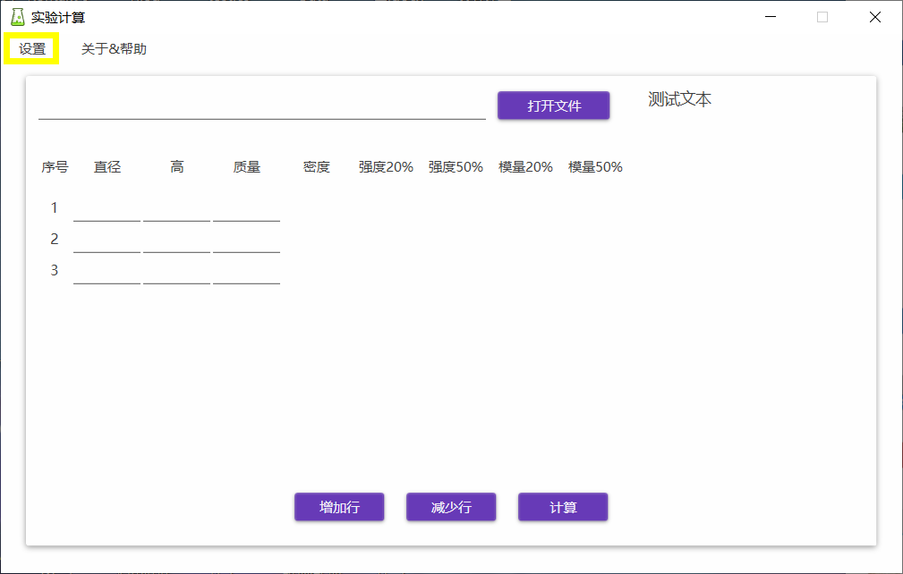
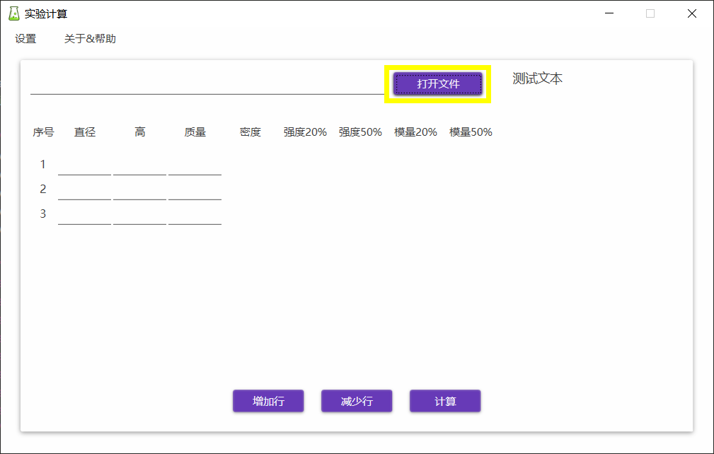
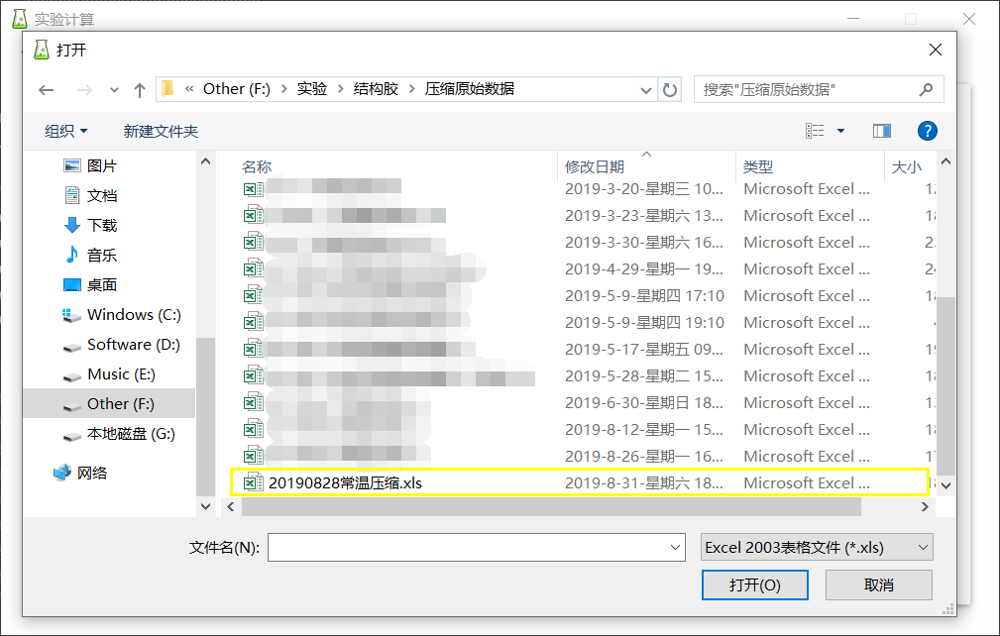

# 快速开始

## 下载运行

[点击此处](https://github.com/AncientTree/Experimental_Calculator/releases/download/v1.1.0/Release.rar)下载软件，解压、存放于记得的路径。双击“实验计算.exe”即可运行。

## 使用流程

1. 点击菜单栏的“设置”按钮，打开设置，选择要计算的两个应变百分比：比如我要计算20%应变时的强度模量、50%应变时的强度模量，我就选择20% 和 50%这两个。

   

   

2. 点击“打开文件”按钮，打开文件选择框，选择excel文件，这个文件是从实验室的力学测试仪配套软件上在压缩测试结束之后导出原始数据得到的文件，后缀名为.xls。

   

   

3. 填入直径、高、质量数据，点击计算，即可得到数据：

   

   

4. 点击“增加行”，“减少行”按钮可以改变要计算的行数，这取决于你有多少个样品（相应地，Excel表格中必须有同样数量的Sheet）。

   